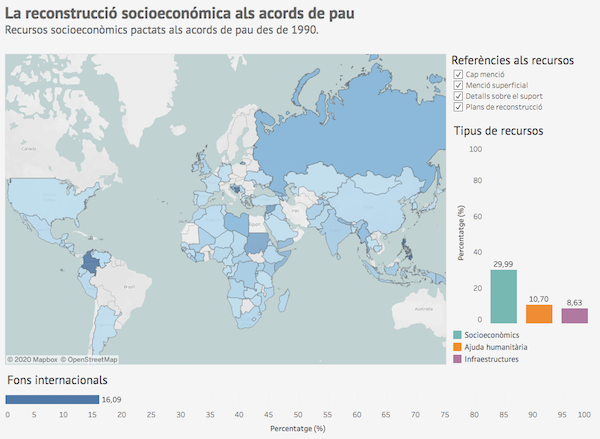

#  La reconstrucció socioeconòmica als acords de pau

[English version](README_en.md)

Aquest treball mostra el procés d'elaboració d'una visualització de dades a partir de la informació dels acords de pau 
a tot el món proporcionada pel projecte [Peace Agreements](https://www.peaceagreements.org/) de la Universitat d'Edimburg.

## Visualització de dades

La visualització de dades es troba publicada a [Tableau Public](https://public.tableau.com/profile/vboix2#!/vizhome/PeaceAgreements_15779063007210/Visualitzacio). 
El seu objectiu és representar el nombre d'acords de pau que inclouen referències a la reconstrucció i el desenvolupament socioeconòmic d'una 
regió després d'un conflicte, mostrant aspectes com la distribució geogràfica, el nivell de detall de l'acord i la finalitat dels recursos.

## Dades

Les dades utilitzades formen part del conjunt de dades obertes del projecte Peace Agreements de la Universitat 
d'Edimburg i contenen informació sobre els acords de pau signats a tot el món des de 1990.

El directori [data](./data) conté tots els fitxers utilitzats per a la construcció de la visualització i 
el codi utilitzat per a la neteja i transformació de les dades.

* [pax_all_agreements_data.xlsx](./data/pax_all_agreements_data.xlsx) - Dades originals disponibles al projecte Peace Agreements
* [data.csv](./data/data.csv) - Dades seleccionades en format CSV
* [transform.py](./data/transform.py) - Codi utilitzat per a la neteja i transformació de les dades
* [data_transformed.csv](./data/data_transformed.csv) - Dades processades utilitzades a la visualització
* [CountryCodes_alpha3.csv](./data/CountryCodes_alpha3.csv) - Nom i codi dels països segons la ISO 3166-1 alpha-3

## Documents

El procés d'elaboració de la visualització es troba detallat als informes de la carpeta [documents](./documents).

* [PAC2](./documents/PAC2_VictorBoix.pdf) - Exploració del conjunt de dades
* [PAC3](./documents/PAC3_VictorBoix.pdf) - Informe de la visualització
* [PAC4](./documents/PAC4_VictorBoix.pdf) - Presentació de la visualització

## Referències

* BELL, C.; BADANJAK, S.; FORSTER, R.; JAMAR, A.; MOLLOY, S.; MCNICHOLL, K.; NASH, K.; POSPISIL, J.; WISE, L (2019). 
PA-X Peace Agreements Database and Dataset, Version 2. Political Settlements Research Programme, 
University of Edinburgh, Edinburgh. http://www.peaceagreements.org

Aquesta obra està subjecta a una llicència de [Reconeixement 4.0 Internacional de Creative Commons](https://creativecommons.org/licenses/by/4.0/)