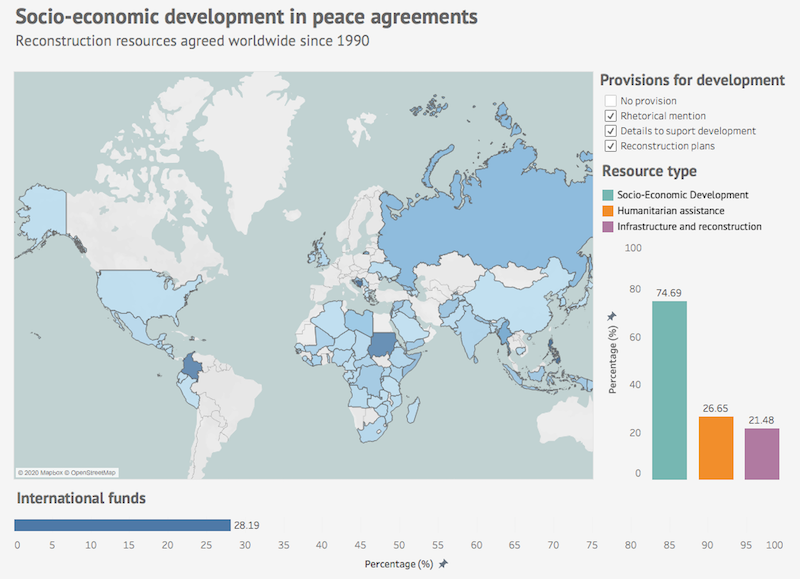

#  Socio-economic development at peace agreements

This work shows the elaboration process of data visualization based on information from 
[Peace Agreements](https://www.peaceagreements.org/) project of the University of Edinburgh.

## Data visualization

Data visualization is published on [Tableau Public](https://public.tableau.com/profile/vboix2#!/vizhome/PeaceAgreements_15783398211110/Dashboard). 
It represents the number of peace agreements that include references to reconstruction and socio-economic development 
of a region after a conflict, showing aspects such as geographical distribution, purpose of resources and level of agreement details.

## Data

Dataset is part of the Peace Agreements Database and contains information about peace agreements signed worldwide since 1990.

The [data](./data) folder contains all the files used to build the data visualization:

* [pax_all_agreements_data.xlsx](./data/pax_all_agreements_data.xlsx) - Original data from Peace Agreements project
* [data.csv](./data/data.csv) - Selected data in CSV format
* [transform.py](./data/transform.py) - Code used for data cleaning
* [data_transformed.csv](./data/data_transformed.csv) - Transformed data used in the visualization
* [CountryCodes_alpha3.csv](./data/CountryCodes_alpha3.csv) - Country name and code according to ISO 3166-1 alpha-3

## Documents

The creation process of the visualization is detailed in the [documents](./documents) folder.

* [PAC2](./documents/PAC2_VictorBoix.pdf) - Dataset exploration
* [PAC3](./documents/PAC3_VictorBoix.pdf) - Visualization report
* [PAC4](./documents/PAC4_VictorBoix.pdf) - Visualization presentation

## References

* BELL, C.; BADANJAK, S.; FORSTER, R.; JAMAR, A.; MOLLOY, S.; MCNICHOLL, K.; NASH, K.; POSPISIL, J.; WISE, L (2019). 
PA-X Peace Agreements Database and Dataset, Version 2. Political Settlements Research Programme, 
University of Edinburgh, Edinburgh. http://www.peaceagreements.org

----

This work is licensed under a [Creative Commons Attribution 4.0 International License](https://creativecommons.org/licenses/by/4.0/)